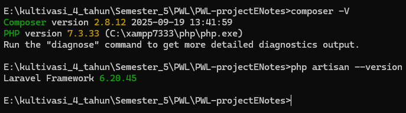
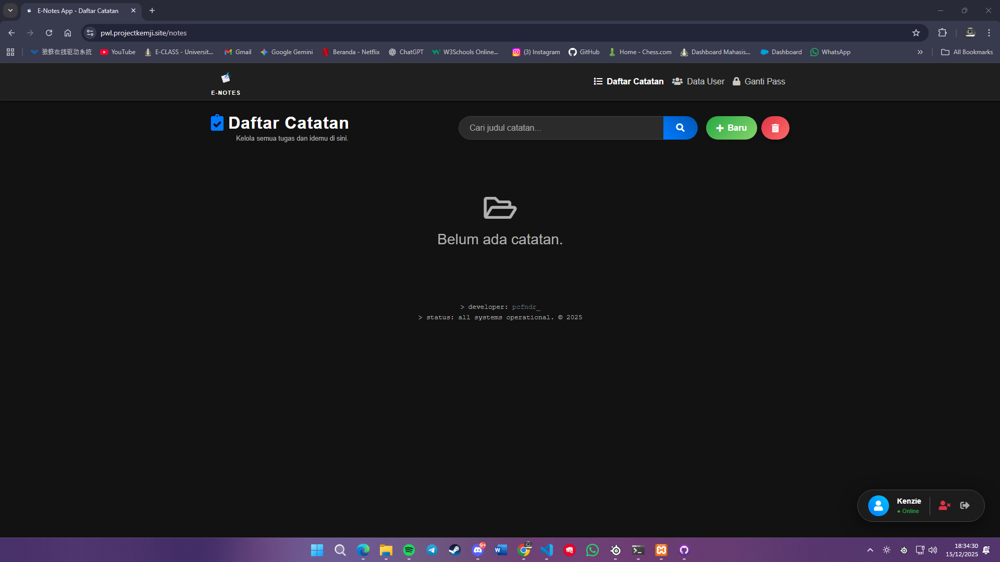

# 📝 E-Notes App (UAS PWL)

> **Project Ujian Akhir Semester (UAS) - Pemrograman Web Lanjut**
> Aplikasi manajemen catatan berbasis web dengan framework **Laravel 6**, tampilan **Modern Dark Mode**, fitur upload gambar, dan manajemen pengguna yang lengkap.


## 📖 Deskripsi

**E-Notes** adalah aplikasi pencatat digital yang dirancang untuk memenuhi studi kasus UAS. Aplikasi ini memungkinkan pengguna untuk membuat catatan pribadi yang dilengkapi dengan gambar, mengelola profil, serta fitur administrasi untuk mengelola data pengguna lain. Dibangun dengan antarmuka **Dark Mode Premium** yang responsif dan interaktif.

Repository: [https://github.com/kenziecarlen13/PWL-projectENotes](https://github.com/kenziecarlen13/PWL-projectENotes)

---

## ✨ Fitur Unggulan (Sesuai Ketentuan UAS)

Aplikasi ini mencakup seluruh poin penilaian (a-h) dalam ketentuan UAS:

### 1. Manajemen Catatan (Master Data Utama)
* **CRUD Lengkap:** Create, Read, Update, Delete data catatan.
* **Upload Gambar:** Setiap catatan mendukung upload gambar (disimpan di `storage`).
* **Search Engine:** Fitur pencarian catatan berdasarkan judul (Real-time backend).
* **Bulk Delete:** Fitur "Hapus Semua" dengan konfirmasi keamanan (Modal).
* **UI Modern:** Tampilan Grid Card dengan Hero Image pada detail catatan.

### 2. Manajemen User (Master Data User)
* **DataTables:** Menampilkan daftar pengguna terdaftar dengan fitur Search & Pagination otomatis.
* **User Deletion:** Admin dapat menghapus user lain (dengan proteksi tidak bisa menghapus diri sendiri saat login).

### 3. Keamanan & Autentikasi
* **Auth System:** Login, Register, dan Logout.
* **Change Password:** Fitur ubah password dengan validasi **Password Lama** (Wajib UAS Poin 2f & 3d).
* **Delete Account:** User dapat menghapus akun sendiri secara permanen.
* **Middleware:** Pembatasan hak akses halaman (Route Protection).

### 4. UI/UX Premium
* **Dark Mode:** Tema gelap dengan aksen Neon/Glow.
* **Interactive Elements:** Tombol gradient, animasi hover, search bar kapsul, dan Modal Bootstrap custom.
* **Responsive:** Tampilan rapi di Desktop dan Mobile.

---

## 📸 Screenshots

Berikut adalah bukti penggunaan versi Laravel dan tampilan aplikasi:

### 1. Bukti Versi Framework


<br>

### 2. Tampilan Dashboard


---

## 🚀 Cara Instalasi (Installation Guide)

Ikuti langkah-langkah ini untuk menjalankan project di komputer lokal (Localhost):

### Prasyarat
* PHP >= 7.2
* Composer
* Database (MySQL/MariaDB via XAMPP/Laragon)

### Langkah-langkah

1. **Clone Repository**
   ```bash
   git clone [https://github.com/kenziecarlen13/PWL-projectENotes.git](https://github.com/kenziecarlen13/PWL-projectENotes.git)
   cd PWL-projectENotes/enotes
   ```

2.  **Install Dependencies**
    ```bash
    composer install
    ```

3.  **Konfigurasi Environment (.env)**
    * Duplikat file `.env.example` menjadi `.env`.
    * Atur koneksi database:
    ```env
    DB_CONNECTION=mysql
    DB_HOST=127.0.0.1
    DB_PORT=3306
    DB_DATABASE=enotes_db  <-- Ganti dengan nama database kamu
    DB_USERNAME=root
    DB_PASSWORD=
    ```

4.  **Generate App Key**
    ```bash
    php artisan key:generate
    ```

5.  **Migrasi Database**
    Pastikan XAMPP/MySQL sudah nyala, lalu jalankan:
    ```bash
    php artisan migrate
    ```

6.  **Link Storage (PENTING ⚠️)**
    Agar gambar yang diupload muncul, jalankan perintah ini untuk membuat symlink:
    ```bash
    php artisan storage:link
    ```

7.  **Jalankan Server**
    ```bash
    php artisan serve
    ```

8.  **Akses Aplikasi**
    Buka browser dan kunjungi: [http://127.0.0.1:8000](http://127.0.0.1:8000)

---

## 🛠️ Troubleshooting

**Masalah: Gambar tidak muncul setelah deploy/clone?**
Jika gambar *broken* (rusak), kemungkinan symlink `storage` belum terhubung.
1.  Hapus folder `public/storage` jika ada.
2.  Jalankan `php artisan storage:link` lagi.
3.  Atau akses route khusus perbaikan: `http://127.0.0.1:8000/link-storage`

**Masalah: Tampilan CSS tidak berubah?**
Lakukan clear cache view:
```bash
php artisan view:clear
